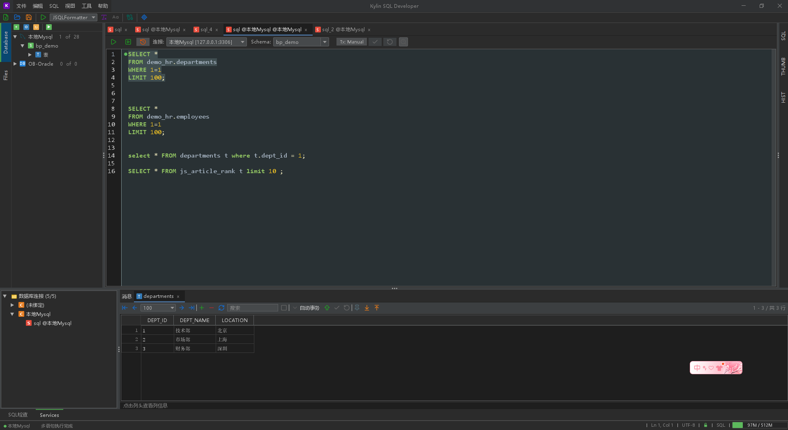
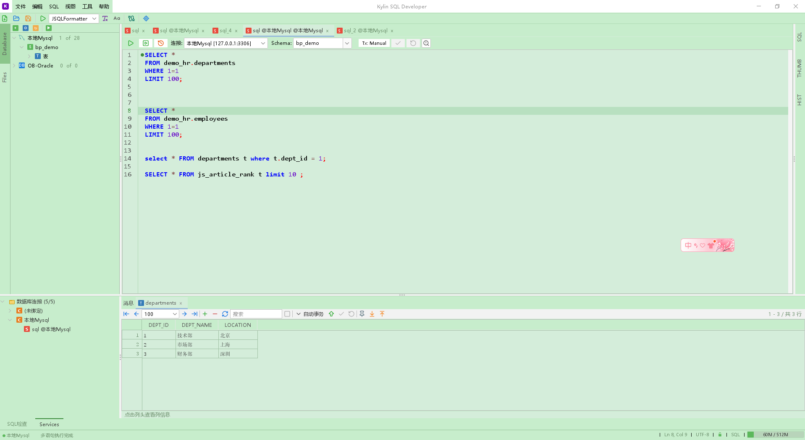
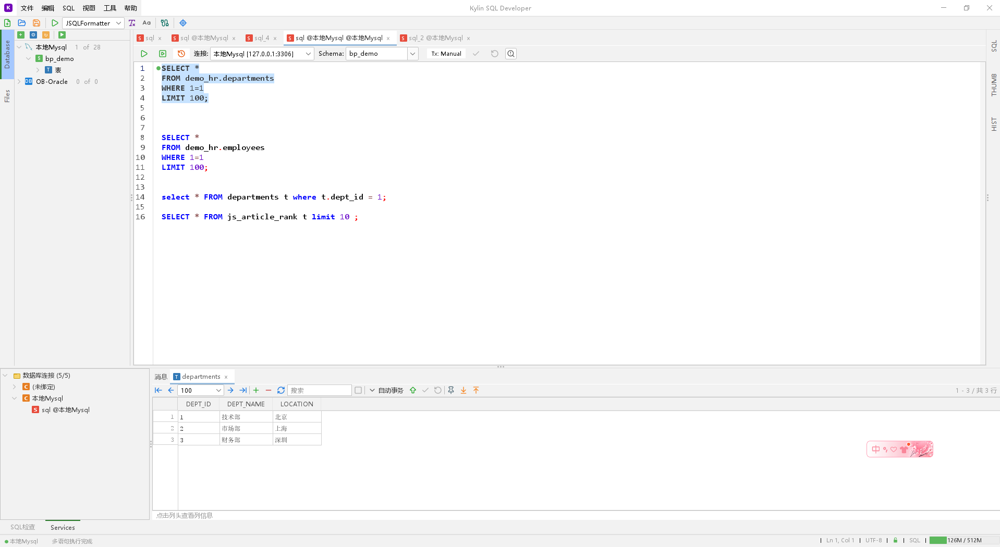

<div align="center">
  
  <h1>Kylin SQL Developer</h1>
  <p><strong>Lightweight · Cross-platform · PL/SQL IDE</strong></p>
  <p>Multi-database SQL formatter &amp; IDE with syntax highlighting, auto-completion, JDBC client and data export. Supports Oracle, OceanBase, MySQL, PostgreSQL.</p>

  <p>
    
    
    
    
    
    
    <br>
    
    
    
    
    
    
    <br>
    
    
    
    
    
    
  </p>
</div>

---

## Table of Contents

- [Introduction](#introduction)
- [Features](#features)
- [Screenshots](#screenshots)
- [Database Support](#database-support)
- [Comparison](#comparison)
- [Quick Start](#quick-start)
- [Build from Source](#build-from-source)
- [Keyboard Shortcuts](#keyboard-shortcuts)
- [Tech Stack](#tech-stack)
- [Architecture](#architecture)
- [License](#license)

---

## Introduction

**Kylin SQL Developer** is a lightweight, cross-platform PL/SQL IDE designed for **Oracle / OceanBase / MySQL / PostgreSQL** databases. Built with Java Swing, it integrates a syntax-highlighting editor, a template-driven SQL formatter, intelligent auto-completion, data export, and an object browser — with first-class support for the **Kylin OS** (a domestic Linux distribution widely used in China).

> This project originated from the need for a modern PL/SQL development tool targeting OceanBase Oracle mode. Under the broader trend of domestic technology adoption in China, we hope to provide developers with a free, open-source, and polished database IDE.

---

## Features

### Editor

| Feature | Description |
|---------|-------------|
| Syntax Highlighting | Powered by RSyntaxTextArea with a custom PL/SQL TokenMaker |
| Code Folding | Collapse functions, procedures, packages, IF, LOOP blocks |
| Auto-Completion | Table names, views, columns, and keywords driven by MetadataCache |
| Multi-Tab Editing | Edit multiple SQL files simultaneously |
| Line Markers | Execution results shown as ✓/❗ icons in the gutter |
| Find & Replace | Ctrl+F search / Ctrl+H replace |

### SQL Formatter

- **4 database dialects**: Oracle, OceanBase, MySQL, PostgreSQL
- **40+ configurable parameters**: keyword case, indentation, comma position, WHERE clause alignment, and more
- **3 built-in presets**: Default / Expanded / Compact
- **Template-driven 4-stage constraint solver**: Structural Resolution → Line Width → Alignment → Layout Merge
- **Full PL/SQL support**: stored procedures, functions, packages, triggers, cursors, exception handlers
- **Built-in fallback engine**: JSQLFormatter (JSQLParser-based)

### Database Connectivity

- 6 database types: Oracle, OceanBase (Oracle mode), OceanBase (MySQL mode), MySQL, MariaDB, PostgreSQL
- Connection pooling via HikariCP
- Per-tab independent connections + schema selection
- Color-coded connections for easy visual distinction
- Auto-reconnect monitoring
- Configurable query timeout

### Data Export

- **5 output formats**: INSERT / CSV / JSON / XML / Markdown
- **3 export modes**: Result Set / Table mode (cascading Schema→Table selection) / Custom SQL
- Background batch export task management
- INSERT dialect support: Oracle / MySQL / PostgreSQL / ANSI

### Object Browser

- Database tree: Connection → Schema → Tables / Views / Functions / Procedures / Packages
- Double-click → Data preview
- Right-click context menu → DDL / DML / Expand Package
- Persistent tree expansion state across restarts
- Local file browser

### Built-in Tools

| Tool | Shortcut | Description |
|------|----------|-------------|
| Global Object Search | `Ctrl+P` | Cross-database object name search |
| Call Hierarchy | `Ctrl+Alt+H` | Analyze PL/SQL call dependencies |
| Data Generator | - | Generate test data |
| Text Diff | - | Compare two SQL texts |
| Regex Tester | - | Real-time regular expression debugger |
| SQL History | `Ctrl+Shift+H` | Persistent query history |
| Explain Plan | `Ctrl+E` | View SQL execution plan |

### Themes

- **Darcula** (dark mode)
- **Light** (light mode)
- **Bean Green** (eye-comfort mode)
- Fully customizable via XML theme files

---

## Screenshots

### Darcula (Dark Theme)



### Green (Eye-care Theme)



### Light (Light Theme)



---

## Database Support

| Database | Key | Default Port | Driver Class | Protocol Family |
|----------|-----|-------------|--------------|-----------------|
| Oracle | `oracle` | 1521 | oracle.jdbc.OracleDriver | ORACLE |
| OceanBase (Oracle mode) | `oceanbase-oracle` | 2883 | com.oceanbase.jdbc.Driver | ORACLE |
| OceanBase (MySQL mode) | `oceanbase-mysql` | 2883 | com.oceanbase.jdbc.Driver | MYSQL |
| MySQL | `mysql` | 3306 | com.mysql.cj.jdbc.Driver | MYSQL |
| MariaDB | `mariadb` | 3306 | org.mariadb.jdbc.Driver | MYSQL |
| PostgreSQL | `postgresql` | 5432 | org.postgresql.Driver | OTHER |

---

## Comparison

| Feature | **Kylin SQL Developer** | **PL/SQL Developer** | **DBeaver** | **Navicat** | **DataGrip** |
|---------|:---:|:---:|:---:|:---:|:---:|
| Cross-platform | ✅ | ❌ Windows only | ✅ | ❌ Win/Mac | ✅ |
| Kylin OS support | ✅ Native | ❌ | ⚠️ Manual | ❌ | ❌ |
| Free & Open Source | ✅ GPL v3 | ❌ Commercial | ✅ | ❌ Commercial | ❌ Commercial |
| Oracle PL/SQL Formatting | ✅ 40+ params | ✅ | ❌ Basic | ✅ Basic | ✅ Medium |
| Smart Completion | ✅ MetadataCache | ✅ | ✅ | ✅ | ✅ |
| Data Export | ✅ 5 formats | ✅ Limited | ✅ | ✅ | ✅ |
| Connection Pool | ✅ HikariCP | ❌ | ✅ | ❌ | ❌ |
| Lightweight (~15MB) | ✅ | ✅ | ❌ (~200MB) | ❌ (~100MB) | ❌ (~400MB) |
| JDK 17+ | ✅ | N/A | ✅ | N/A | ✅ |
| Startup Speed | ⚡ <3s | ⚡ <2s | 🐢 ~8s | ⚡ <3s | 🐢 ~10s |

---

## Quick Start

### Download

Get the latest release from the [Releases page](https://github.com/small-rose/kylin-SQL-Developer/releases):

| Package | Platform | How to Run |
|---------|----------|------------|
| `.zip` | Windows | Extract and run `kylin-sql.bat` |
| `.tar.gz` | Linux / macOS | Extract and run `kylin-sql.sh` |
| `.deb` | Kylin V10 (native) | `sudo dpkg -i kylin-sql-*.deb`, then run `kylin-sql` |

### System Requirements

| Requirement | Minimum | Recommended |
|-------------|---------|-------------|
| JDK | 17+ | 17 LTS or higher |
| RAM | 256 MB | 1 GB+ |
| Disk | 100 MB | 500 MB |
| OS | Windows 10 / Linux (Kylin) / macOS 12+ | - |
| Screen Resolution | 1280×720 | 1920×1080+ |

### Windows Startup

```bat
set JAVA_HOME=C:\Program Files\Java\jdk-17
kylin-sql.bat
```

### Linux / macOS Startup

```bash
export JAVA_HOME=/usr/lib/jvm/java-17-openjdk
./kylin-sql.sh
```

### First Use

1. Click the **Connection Manager** button (🔗 icon) on the toolbar
2. Fill in connection details: host, port, database name, username, password
3. Click **Test Connection** to verify connectivity
4. Save the connection and browse database objects in the left object browser
5. Type SQL in the editor and press `F8` to execute
6. Use `Ctrl+Shift+F` to format SQL

---

## Build from Source

### Prerequisites

- JDK 17+
- Maven 3.8+
- Git

### Quick Build

```bash
# Clone the repository
git clone https://github.com/small-rose/kylin-SQL-Developer.git
cd kylin-SQL-Developer

# Build and package (skip tests)
mvn clean package -DskipTests

# Output:
#   kylin-sql-assembly/target/kylin-sql-1.0.0.zip
#   kylin-sql-assembly/target/kylin-sql-1.0.0.tar.gz
```

### Build & Run in One Step

```bash
mvn package -pl kylin-sql-assembly -am -DskipTests
cd dist/kylin-sql-1.0.0-SNAPSHOT
kylin-sql.bat        # Windows
# or ./kylin-sql.sh  # Linux / macOS
```

> The `package` phase automatically extracts the zip archive to the `dist/` directory in the project root — no manual extraction needed.

### Build Native DEB Package (Kylin OS)

> Requires **Kylin V10 SP1** environment

```bash
sudo yum install -y java-17-openjdk-devel maven rpm-build
mvn clean package -DskipTests -Pdeb
sudo dpkg -i target/kylin-sql-*.deb
kylin-sql
```

### Modules

| Module | Description |
|--------|-------------|
| `kylin-sql-parser` | ANTLR4 PL/SQL parser |
| `kylin-sql-formatter` | Template-driven SQL formatter (4-stage constraint solver) |
| `kylin-sql-core` | Business logic: connection management, services, export, cache, config |
| `kylin-sql-ui` | Swing UI: main window, dialogs, editor components |
| `kylin-sql-assembly` | Distribution packaging: zip/tar.gz/deb + launch scripts |

---

## Keyboard Shortcuts

### File Operations

| Shortcut | Action |
|----------|--------|
| `Ctrl+N` | New SQL file |
| `Ctrl+O` | Open SQL file |
| `Ctrl+S` | Save |
| `Ctrl+Shift+S` | Save As |
| `Ctrl+W` | Close current tab |

### Editing

| Shortcut | Action |
|----------|--------|
| `Ctrl+Z` | Undo |
| `Ctrl+Y` | Redo |
| `Ctrl+F` | Find |
| `Ctrl+H` | Replace |

### SQL Execution

| Shortcut | Action |
|----------|--------|
| `F8` / `Ctrl+Shift+F10` | Execute current SQL |
| `F9` | Append execute (keep previous results) |
| `Ctrl+E` | Explain Plan |
| `Ctrl+Shift+F` | Format SQL |

### Navigation

| Shortcut | Action |
|----------|--------|
| `Ctrl+P` | Global object search |
| `Ctrl+Shift+H` | SQL history |
| `Ctrl+Alt+H` | Call hierarchy |
| `Ctrl+Alt+S` | Settings |

---

## Tech Stack

| Technology | Purpose |
|------------|---------|
| **Java 17** | Development language |
| **Swing / FlatLaf 3.5** | UI framework & themes |
| **RSyntaxTextArea 3.6** | Code editor component |
| **AutoComplete 3.3** | Auto-completion |
| **ANTLR4 4.13** | SQL parser generator |
| **HikariCP 6.2** | Database connection pool |
| **Gson 2.11** | JSON serialization |
| **SVGSalamander 1.1** | SVG icon rendering |
| **Logback 1.5** | Logging framework |
| **Maven 3.8+** | Build tool |
| **JUnit 5** | Unit testing |

---

## Architecture

### Layered Architecture

```
┌─────────────────────────────────────────┐
│           UI Layer (Swing)              │  kylin-sql-ui
│  MainFrame · Dialogs · Editors · Panels │
├─────────────────────────────────────────┤
│           Service Layer                 │  kylin-sql-core
│  Schema / DataQuery / DataChange /      │
│  Export / Import / ServiceFactory       │
├─────────────────────────────────────────┤
│           DB Layer                      │  kylin-sql-core
│  ConnectionManager · SqlExecutor ·      │
│  ConnectionPool (HikariCP) · History    │
├─────────────────────────────────────────┤
│         Format Engine                   │  kylin-sql-formatter
│  4-stage Constraint Solver:             │
│  StructuralResolver → LineWidthResolver │
│  → AlignmentResolver → LayoutMerger     │
├─────────────────────────────────────────┤
│         Parser (ANTLR4)                 │  kylin-sql-parser
│  PL/SQL Lexer · Parser · SymbolIndex   │
└─────────────────────────────────────────┘
```

### Formatter Engine Pipeline

```
Source SQL
    ↓ Tokenizer
Token Stream
    ↓ ConstraintGenerator (40+ parameters)
Constraint Spec
    ↓ Stage 1: StructuralResolver → Indent skeleton
    ↓ Stage 2: LineWidthResolver  → Line break decisions
    ↓ Stage 3: AlignmentResolver  → Column alignment
    ↓ Stage 4: LayoutMerger       → Output assembly
Formatted SQL
```

### File Count

| Module | Source Files |
|--------|-------------|
| kylin-sql-parser | ANTLR4 grammar files |
| kylin-sql-formatter | ~70+ |
| kylin-sql-core | 40 |
| kylin-sql-ui | 39 |
| kylin-sql-assembly | 9 scripts + config |
| **Total** | **~160+** |

---

## License

This project is licensed under the **GNU General Public License v3 (GPL v3)** — a strong copyleft license that ensures modified versions remain open source.

See the full license text in the [LICENSE](LICENSE) file.

```
Kylin SQL Developer - Lightweight PL/SQL IDE
Copyright (C) 2026 Kylin Team

This program is free software: you can redistribute it and/or modify
it under the terms of the GNU General Public License as published by
the Free Software Foundation, either version 3 of the License, or
(at your option) any later version.

This program is distributed in the hope that it will be useful,
but WITHOUT ANY WARRANTY; without even the implied warranty of
MERCHANTABILITY or FITNESS FOR A PARTICULAR PURPOSE.  See the
GNU General Public License for more details.

You should have received a copy of the GNU General Public License
along with this program. If not, see <https://www.gnu.org/licenses/>.
```

---

<div align="center">
  <p>⭐ If you find this project helpful, please give it a star! ⭐</p>
  <p>🤝 PRs are welcome — join us in development!</p>
  <p>
    <a href="https://github.com/small-rose/kylin-SQL-Developer/issues">Report Bug</a>
    ·
    <a href="https://github.com/small-rose/kylin-SQL-Developer/issues">Feature Request</a>
  </p>
</div>
